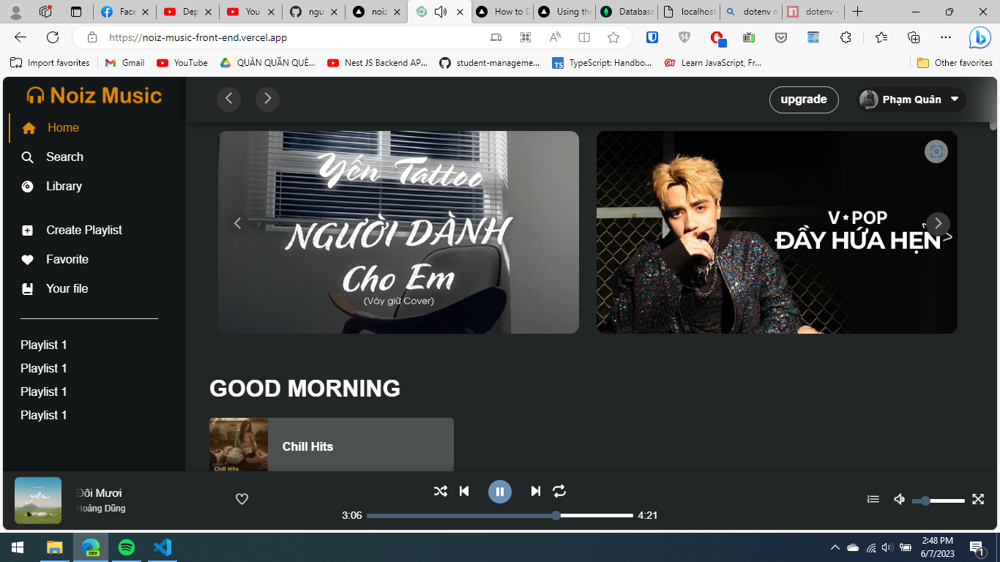
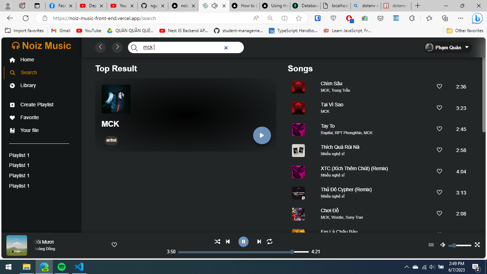
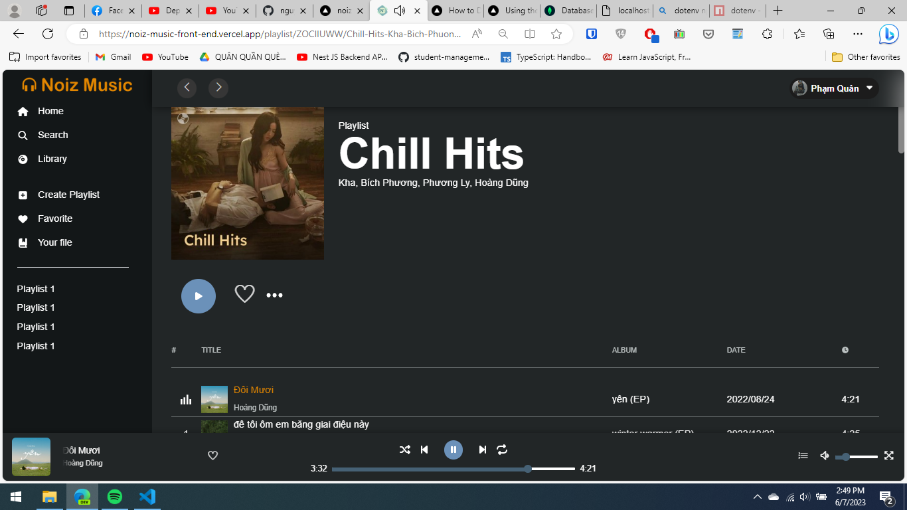

# Noiz Music

## Introduction

    🎧Welcome to Noiz Music, the ultimate destination for music lovers! Our website is dedicated to providing you with the best listening experience with a vast database of songs and artists to choose from. Our music library is based on the renowned ZingMp3 API, ensuring that you have access to high-quality tracks from around the world.

    At Noiz Music, we believe that music is not just a form of entertainment but a way of life. That's why we have created a user-friendly platform that makes it easy for you to discover new artists, create playlists, and share your favorite tracks with friends and family. Whether you're into pop, rock, hip hop, or classical music, we have something for everyone.

## 🔗Link demo

<a margin=5 href="https://noiz-music-front-end.vercel.app/" target="blank">
    
</a>

## 📷Screenshot

### Homepage

<div align="center" style="margin-bottom: 4rem">
    
</div>

### 🔥Search

<div align="center" style="margin-bottom: 4rem">
    
</div>

### 🎥Playlist details

<div align="center" style="margin-bottom: 4rem">
    
</div>

## ⬇️Installation

### 💎Install with docker:

```
docker-compose up
```

️🎵️🎼️🎶Thank you, hope you enjoy!
